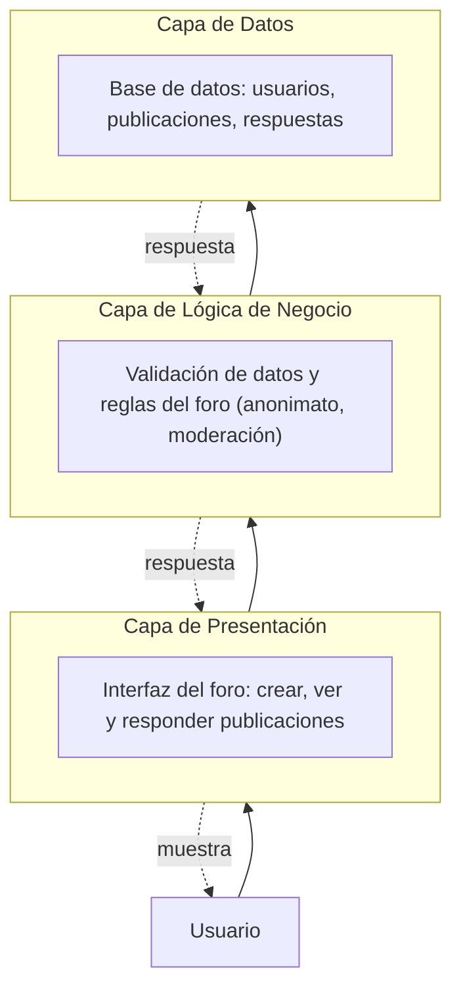

# Foro Anónimo Esperanza

> Espacio anónimo de reflexión y acompañamiento sobre el uso excesivo del teléfono celular.
> Componente del **Proyecto Esperanza** (nombre provisional: *Preventiva*).

---

## Tabla de contenidos

- [Foro Anónimo Esperanza](#foro-anónimo-esperanza)
  - [Tabla de contenidos](#tabla-de-contenidos)
  - [Sobre el proyecto](#sobre-el-proyecto)
  - [Objetivos](#objetivos)
    - [Objetivo general](#objetivo-general)
    - [Objetivos específicos](#objetivos-específicos)
  - [Alcance](#alcance)
  - [Arquitectura por capas](#arquitectura-por-capas)
  - [Requisitos funcionales](#requisitos-funcionales)
  - [Requisitos no funcionales](#requisitos-no-funcionales)
  - [Metodología de trabajo](#metodología-de-trabajo)
  - [Entregables](#entregables)
  - [Aviso importante](#aviso-importante)
  - [Autores](#autores)
  - [Licencia](#licencia)

---

## Sobre el proyecto

El uso excesivo del teléfono celular es cada vez más común, especialmente entre jóvenes y adultos jóvenes, y con frecuencia pasa desapercibido porque no existe un espacio adecuado para reflexionar sobre estos hábitos ni para compartirlos con otras personas en situaciones similares.

**Foro Anónimo Esperanza** es la propuesta de un foro/comunidad anónima dentro de la plataforma **Esperanza**, donde los usuarios pueden:

- Crear publicaciones y compartir experiencias sin exponer su identidad.
- Formular preguntas relacionadas con el uso del celular.
- Consultar y responder publicaciones de otros usuarios.

El **anonimato** es la característica central del espacio: busca que las personas participen con mayor confianza, sin necesidad de revelar quiénes son.

---

##  Objetivos

### Objetivo general
Diseñar y estructurar una propuesta de foro o comunidad anónima para la plataforma Esperanza, que permita a los usuarios compartir experiencias y reflexionar sobre el uso del teléfono celular, desarrollada bajo una arquitectura por capas.

### Objetivos específicos
- Analizar las necesidades y características que debe tener un espacio de participación anónima dentro de Esperanza.
- Diseñar la estructura general del foro: creación y consulta de publicaciones, preguntas y experiencias entre usuarios.
- Estructurar el sistema mediante una arquitectura por capas que separe presentación, lógica de negocio y almacenamiento.
- Desarrollar una propuesta técnica y metodológica basada en **Scrum** que oriente la futura implementación.

---

##  Alcance

**Incluye:**
- Diseño de un foro/comunidad anónima integrado a la plataforma Esperanza.
- Creación y consulta de publicaciones por parte de los usuarios.
- Planteamiento de preguntas, narración de experiencias e intercambio de consejos.
- Interacción básica entre usuarios mediante respuestas a publicaciones.
- Gestión y almacenamiento de publicaciones y respuestas en base de datos.
- Desarrollo bajo arquitectura por capas.

**No incluye:**
- Diagnósticos médicos o psicológicos.
- Sustitución de la atención de profesionales de la salud.
- Terapia o tratamiento de ningún tipo.

> El propósito del foro es exclusivamente **preventivo, educativo y de concientización**: que cada usuario reflexione sobre sus propios hábitos y, si lo considera necesario, busque apoyo profesional por su cuenta.

---

## Arquitectura por capas

El sistema se organiza en tres capas, donde cada una se comunica únicamente con la capa inmediatamente adyacente:

| Capa | Responsabilidad |
|---|---|
| **Presentación** | Interfaz con la que el usuario interactúa: formularios para crear publicaciones, visualización de publicaciones y respuestas. |
| **Lógica de negocio** | Procesa las solicitudes de la capa de presentación, valida la información y aplica reglas del foro (anonimato, moderación básica). |
| **Datos** | Almacenamiento y consulta en base de datos de usuarios, publicaciones y respuestas. |

El flujo de información sigue siempre el mismo camino: el usuario interactúa con la presentación → la solicitud pasa a la lógica de negocio, que la valida → la lógica se comunica con la capa de datos para guardar o consultar información → la respuesta recorre el camino inverso hasta el usuario. Esta separación permite que cambios en una capa (p. ej. la interfaz) no afecten directamente a las demás.

---

##  Requisitos funcionales

| ID | Descripción |
|---|---|
| RF01 | Permitir al usuario acceder al foro sin mostrar públicamente su identidad. |
| RF02 | Permitir crear publicaciones anónimas. |
| RF03 | Permitir consultar las publicaciones disponibles. |
| RF04 | Permitir responder a publicaciones existentes de forma anónima. |
| RF05 | Permitir formular preguntas relacionadas con el uso del teléfono celular. |
| RF06 | Validar que los campos obligatorios de una publicación o respuesta estén diligenciados antes de almacenarlos. |
| RF07 | Almacenar las publicaciones y respuestas en la base de datos. |
| RF08 | Recuperar y mostrar las publicaciones almacenadas. |
| RF09 | Aplicar reglas básicas de moderación definidas para el foro. |
| RF10 | Mantener separada la identidad técnica del contenido que se muestra públicamente (diseño de anonimato). |
| RF11 | Permitir organizar las publicaciones para facilitar su consulta. |
| RF12 | Permitir gestionar o moderar contenido que incumpla las reglas establecidas. |

---

##  Requisitos no funcionales

| ID | Categoría | Descripción |
|---|---|---|
| RNF01 | Seguridad | La información almacenada debe contar con mecanismos de protección y control de acceso. |
| RNF02 | Privacidad | La interfaz pública no debe revelar información que permita identificar al participante. |
| RNF03 | Usabilidad | Interfaz sencilla, clara y comprensible para usuarios con distintos niveles de experiencia. |
| RNF04 | Rendimiento | Las consultas y operaciones habituales deben responder en un tiempo razonable bajo la carga prevista. |
| RNF05 | Disponibilidad | El sistema debe estar disponible durante los periodos definidos para su uso. |
| RNF06 | Mantenibilidad | La separación por capas debe facilitar la modificación y mantenimiento de cada componente. |
| RNF07 | Escalabilidad | La estructura debe permitir aumentar usuarios, publicaciones y respuestas sin reconstruir el sistema. |
| RNF08 | Integridad | La información almacenada debe conservar relaciones y consistencia entre usuarios, publicaciones y respuestas. |
| RNF09 | Compatibilidad | La aplicación debe funcionar correctamente en los entornos y navegadores definidos para el proyecto. |
| RNF10 | Recuperación | Deben contemplarse mecanismos de respaldo y recuperación de la información. |

---

##  Metodología de trabajo

El desarrollo se propone bajo **Scrum**, dividiendo el trabajo en *sprints* cortos:

1. Se definen **historias de usuario** ligadas a las funcionalidades principales (crear publicación, responder, consultar contenido, etc.).
2. Cada historia se trabaja dentro de un sprint, desarrollando y probando el foro de forma incremental.
3. Al final de cada sprint se revisa el avance y se incorpora la retroalimentación obtenida al siguiente ciclo.
4. Cada funcionalidad se distribuye entre las tres capas de la arquitectura (presentación, lógica de negocio, datos) a medida que se implementa.

> Ejemplo: al implementar "crear publicación", la capa de presentación aporta el formulario, la capa de lógica de negocio valida el contenido y aplica las reglas de anonimato, y la capa de datos almacena la publicación para su consulta posterior.

---

## Entregables

- [ ] Documento de requisitos del sistema
- [ ] Diseño general de la arquitectura
- [ ] Diseño de la base de datos
- [ ] Interfaz funcional del foro
- [ ] Módulo de publicaciones y respuestas
- [ ] Mecanismos de anonimato y validación
- [ ] Módulo o herramientas básicas de moderación
- [ ] Pruebas funcionales y registro de resultados
- [ ] Manual técnico y manual básico de usuario
- [ ] Código fuente y elementos necesarios para instalación y puesta en funcionamiento

---

##  Aviso importante

Este foro **no realiza diagnósticos médicos ni psicológicos**, **no reemplaza la atención de profesionales de la salud** y **no constituye una terapia ni un tratamiento**. Su finalidad es exclusivamente preventiva, educativa y de concientización.

---

##  Autores

Proyecto desarrollado en el marco de **Desarrollo de Software**, Corporación Tecnológica Industrial Colombiana (Teinco), Bogotá, Colombia.

| Nombre | Correo |
|---|---|
| Dilan Pinilla | 1026266591@teinco.edu.co |
| Jean Delgadillo | 1019606357@teinco.edu.co |
| Juan Salcedo | 1013117752@teinco.edu.co |

---

##  Licencia

*Por definir.*

---

<em>Proyecto Esperanza — septiembre de 2026</em>

